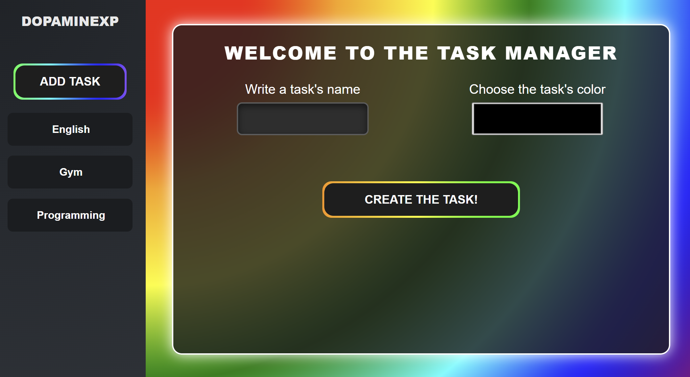
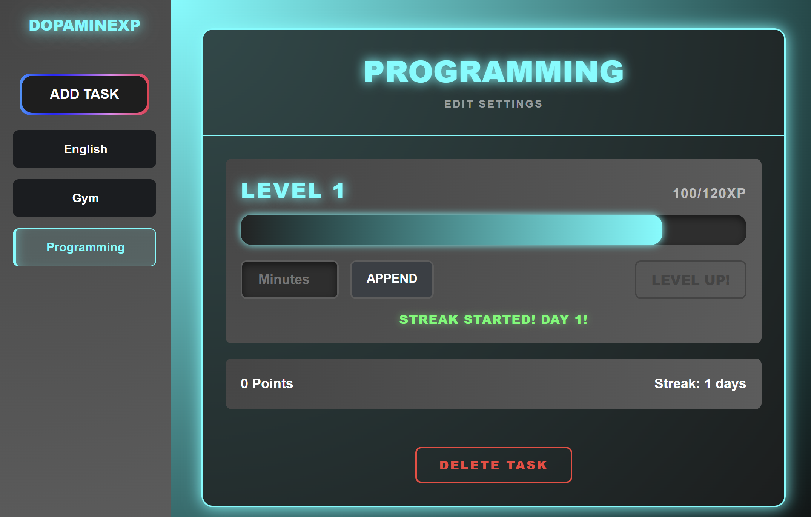
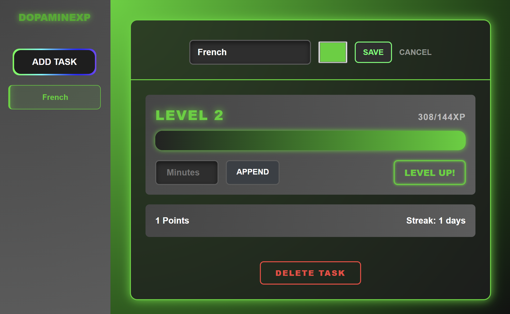

DopamineXP Tracker

A gamified habit tracker built with **Blazor** to help manage productivity and skill development through RPG-style leveling.

## 🚀 Features
* **Dynamic XP System:** Custom math logic for session-based experience gain.
* **Streak Multipliers:** Bonus XP awarded for consistent habit tracking.
* **Persistent Storage:** Data is automatically saved to a JSON file in the user's Documents folder.
* **Modular Architecture:** Utilizes a centralized State Service (TrackerBrain) for cross-page data persistence.

